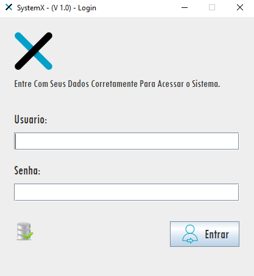
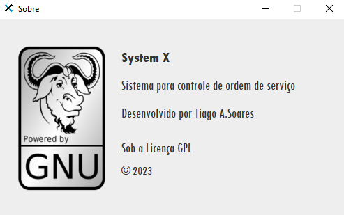

# ☕ SystemX - Java e MySQL

SistemX: É um sistema para gestão de serviços de uma assistência técnica de computadores e notebooks usando Java e banco de dados MySQL.

### Login

    </img>

### Tela Principal

    </img>

## Autor
Tiago Angelo
## Instruções para instalação e uso do aplicativo
### Pré requisitos

1) Ter o Java **versão 8** instalado (só funciona corretamente nesta versão Para Cima do Java). 

[download Java 8](https://www.java.com/pt-BR/)

2) Ter um banco de dados local baseado no **MySQL 8** ou MariaDB compatível, no exemplo usei o XAMPP que pode ser obtido no link indicado.

[download xampp](https://www.apachefriends.org/)

## Tecnologias Usadas para desenvolver este projeto do "zero"
Tecnologias que são abordadas neste tutorial:
- Criação de banco de dados e tabelas no MySQL
- CRUD (Create Read Update e Delete)
- IDE Netbeans
- Java SE
- JDBC (Java Database Connectivity)
- Validação de dados
- Uso do framework JasperSoft Studio para gerar relatórios

### SystemX projeto para servir de Apóio para construir sistemas para assistências técnicas, hoteis etc...

## Lincença GNU General Public License

    </img>

